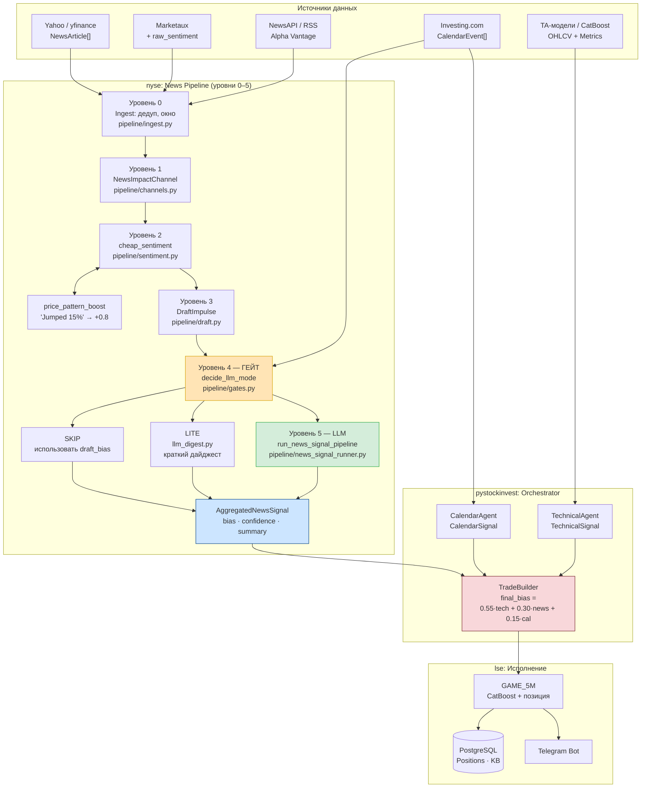
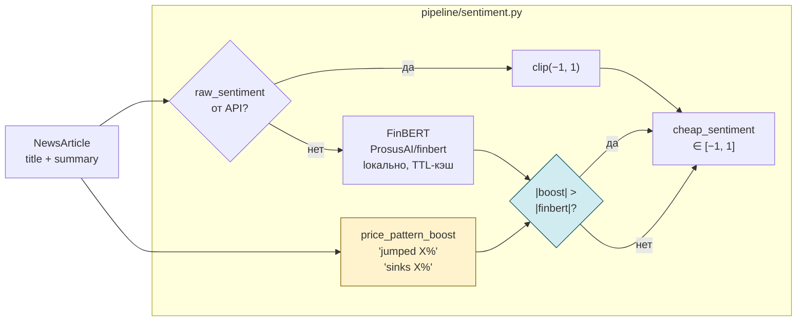
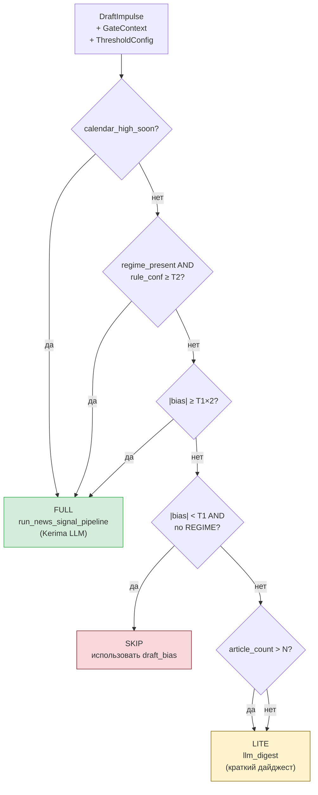
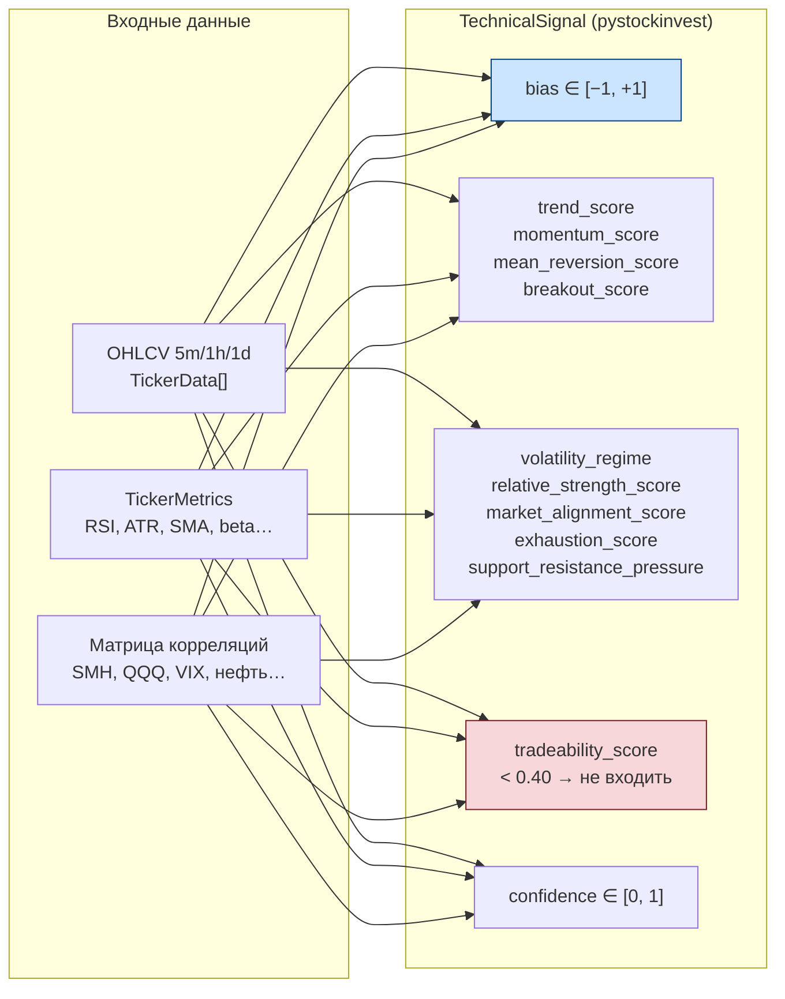
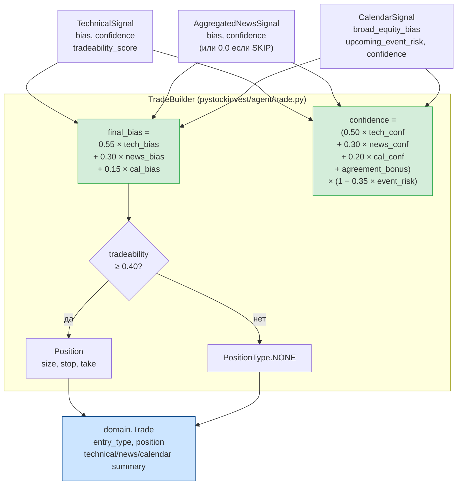
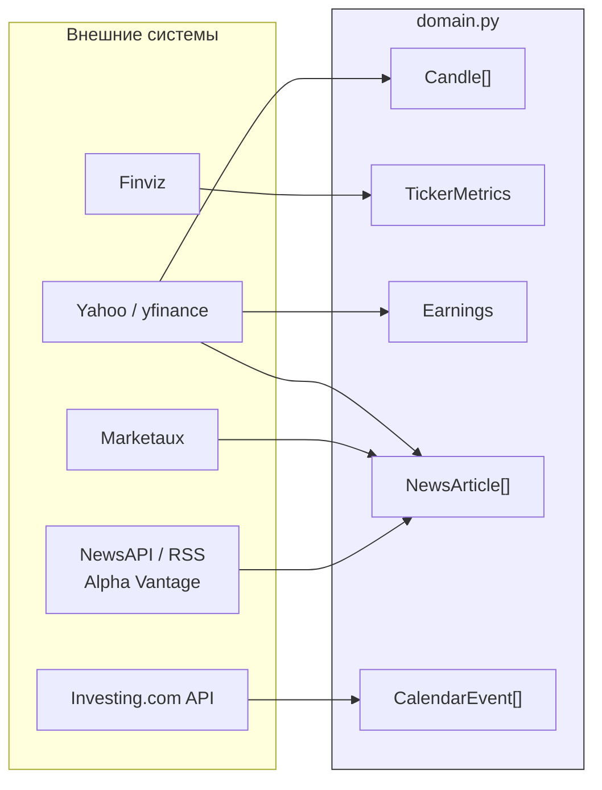

# Потоки данных nyse pipeline

Диаграммы в формате **Mermaid** — корректно отображаются в GitHub preview.

---

## 1. Полный поток: от источника к сделке

---

## 2. Детализация уровня 2: cheap_sentiment

**Масштаб price_pattern_boost:**

| Движение | boost |
|----------|-------|
| ≥ 20% | ±1.0 |
| ≥ 10% | ±0.8 |
| ≥  5% | ±0.6 |
| ≥  2% | ±0.4 |
| < 2%  | ±0.2 |

---

## 3. Детализация уровня 4: решение гейта

**Профили ThresholdConfig** (откалибровано 2026-04-06):

| Профиль | T1 | T1×2 | N | regime_stress_min |
|---------|----|------|---|-------------------|
| `PROFILE_GAME5M` | 0.12 | 0.24 | 8 | 0.05 |
| `PROFILE_CONTEXT` | 0.20 | 0.40 | 15 | 0.05 |

---

## 4. Технический сигнал Kerima (TechnicalSignal)

---

## 5. TradeBuilder: финальное решение

---

## 6. Источники данных (текущий контур)

---

*Схемы — живой документ. При изменении весов TradeBuilder, порогов или новых модулей — обновлять здесь и в `architecture.md`.*
