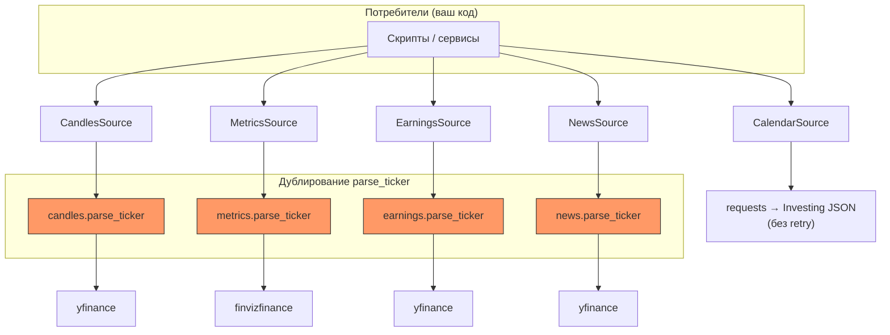
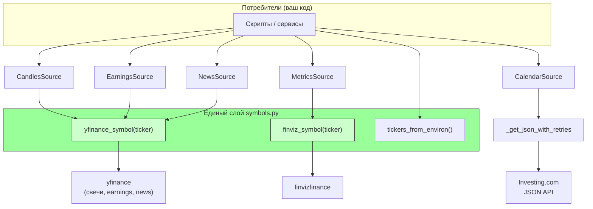
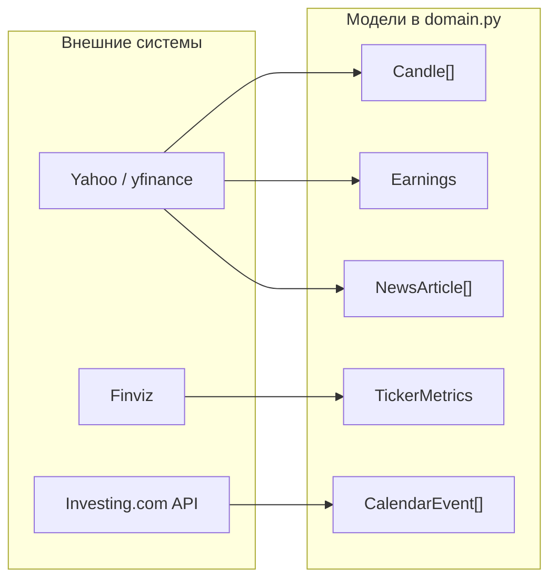
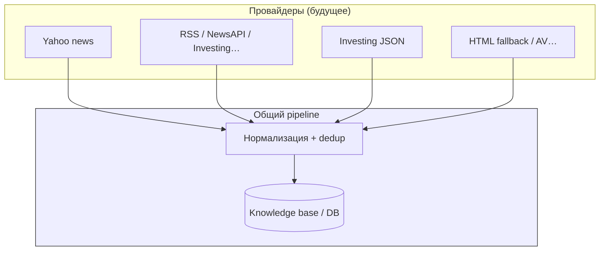

# Потоки данных: было и стало

Документ для **визуального** сопоставления архитектуры источников до рефакторинга и после. Диаграммы в формате **Mermaid** корректно отображаются на **GitHub** при просмотре `.md` файла в репозитории.

---

## 1. Было (исходная версия `sources`)

Каждый модуль содержал **свою копию** `parse_ticker()` с длинной цепочкой `if/elif`. Разные API получали **несогласованные** строки для одного логического инструмента (типичный пример: **VIX** — `^VIX` в одних местах и **VIXY** в других без явной политики). Ошибка в имени публичного API: `get_dayly_candles`. Календарь — один запрос без повторов при 429.

**Проблемы:** четыре места правки при добавлении тикера; риск рассинхрона **VIX** / **BNO**; хрупкий календарь при rate limit.

---

## 2. Стало (текущая версия)

Единая точка сопоставления **`symbols.py`**: **`yfinance_symbol()`** и **`finviz_symbol()`**. Модули источников импортируют только их. **`Ticker.value`** — канон для Yahoo; для Finviz явный override **VIX → VIXY**. Дневные свечи: **`get_daily_candles`** (+ устаревший алиас с предупреждением). Календарь: **`_get_json_with_retries`**. Опционально **`NYSE_TICKERS`** для списка инструментов без изменения enum.

---

## 3. Сводка: откуда что приходит (текущий контур)

Одна диаграмма «внешний мир → тип данных» для обзора.

---

## 4. Целевой контур (ориентир, как в **lse**) — не реализовано

Для следующих итераций: несколько провайдеров новостей/календаря, нормализация, дедуп, запись в БД.

---

*При изменении модулей в `sources/` имеет смысл обновлять этот файл и [architecture.md](./architecture.md), чтобы схемы оставались правдой.*
